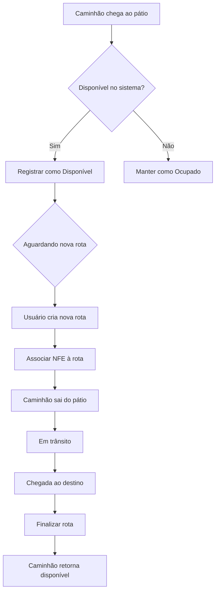

# 🚚 Sistema de Gerenciamento de Caminhões - CDRS

## 📖 Sobre o Projeto

Sistema desenvolvido para otimizar e gerenciar o fluxo logístico da **CENTRO DISTRIBUIÇÃO RAUL SOARES LTDA**. A aplicação foca no controle rigoroso de entrada e saída de veículos, gestão de rotas e organização de documentos fiscais, garantindo que a frota seja utilizada de maneira eficiente e segura.

---

## 📋 Funcionalidades Principais

### ✅ Controle de Pátio
* **Monitoramento em Tempo Real:** Visualização imediata da disponibilidade dos caminhões.
* **Verificação de Veículos:** Checagem automática de veículos livres para novas missões.
* **Bloqueio Inteligente:** O sistema impede a criação de rotas se não houver caminhão disponível fisicamente no pátio.

### 🚛 Gerenciamento de Rotas
* **Alocação de Recursos:** Criação de corridas restrita a caminhões com status "Disponível".
* **Registro Preciso:** Log automático de data e hora na saída do pátio.
* **Ciclo de Vida:** Finalização da rota apenas na chegada confirmada ao destino.
* **Histórico:** Registro completo e auditável de todas as viagens realizadas.

### 📎 Gestão Fiscal (NFE)
* **Upload de PDF:** Anexo direto da Nota Fiscal Eletrônica relacionada à rota.
* **Armazenamento Digital:** Centralização da documentação fiscal internamente.
* **Rastreabilidade:** Vínculo lógico: `NFE` → `Caminhão` → `Rota de Entrega`.

---

## ⚙️ Fluxo de Funcionamento

## 🔒 Regras de Negócio

Para garantir a segurança operacional, o sistema implementa as seguintes restrições:

* **Validação Crítica:** `Sem caminhão no pátio` = `Sem criação de rota`.
* **Um para Um:** Cada rota é composta por **1 Caminhão** e pode conter **1 NFE (PDF)**.
* **Rastreamento de Status:** O veículo só pode estar em um dos três estados: *No pátio*, *Em rota* ou *Entregue*.
* **Flexibilidade Fiscal:** A NFE é opcional para criação da rota, embora recomendada para conferência.

---

## 📊 Benefícios Implementados

* ✅ **Controle de Frota:** Gestão precisa e em tempo real dos ativos da empresa.
* ✅ **Organização Documental:** Centralização segura das NFEs em formato digital.
* ✅ **Prevenção de Erros:** O sistema não permite agendamentos impossíveis de executar.
* ✅ **Auditabilidade:** Histórico completo para conferências futuras.
* ✅ **Digitalização:** Eliminação de processos manuais e controles em papel.

---

## 🖥️ Tecnologias Utilizadas

O projeto foi construído utilizando uma arquitetura robusta e tecnologias modernas:

* 
* 
* 
* 
* 

---

## 👨‍💻 Autor

  Feito com dedicação por <strong>Derick Dutra</strong> 
  Estudante de Ciência da Computação - 5° Período

